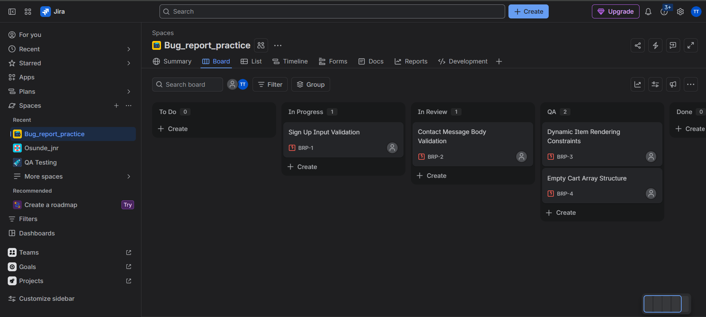
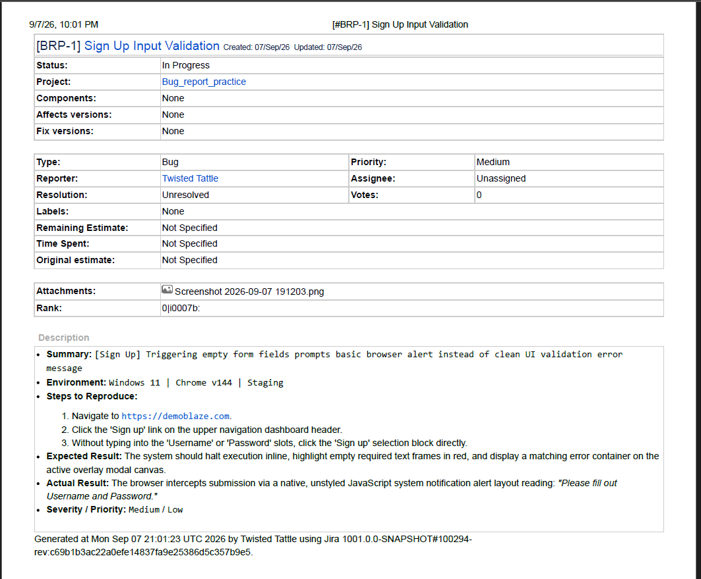
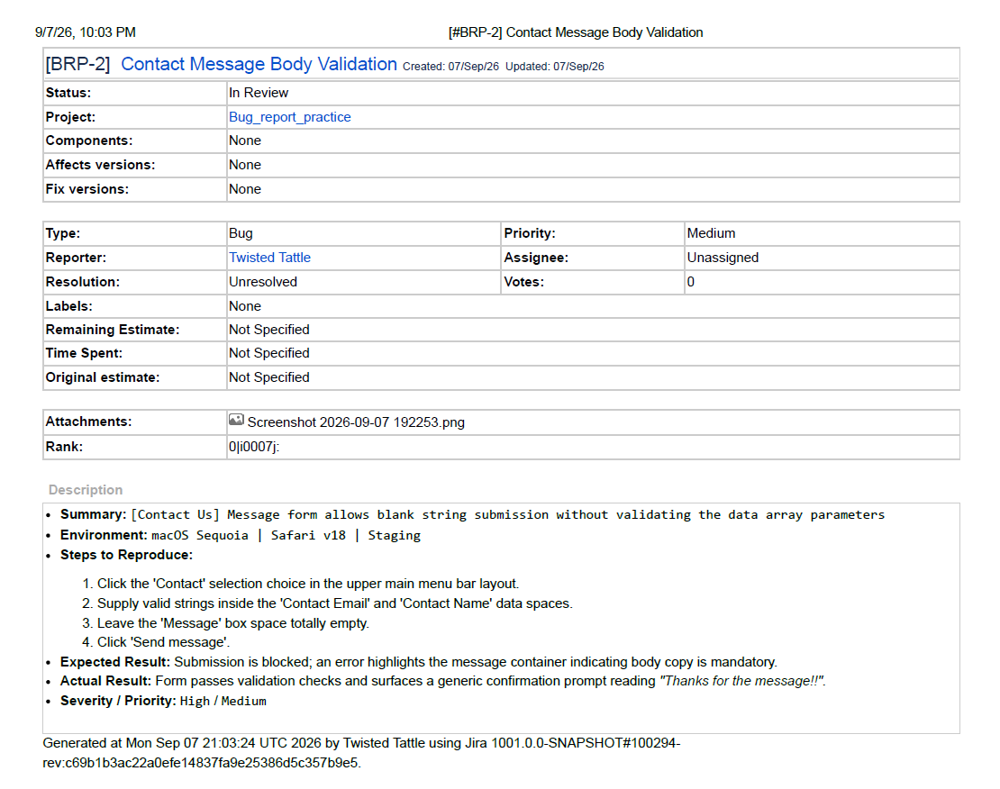
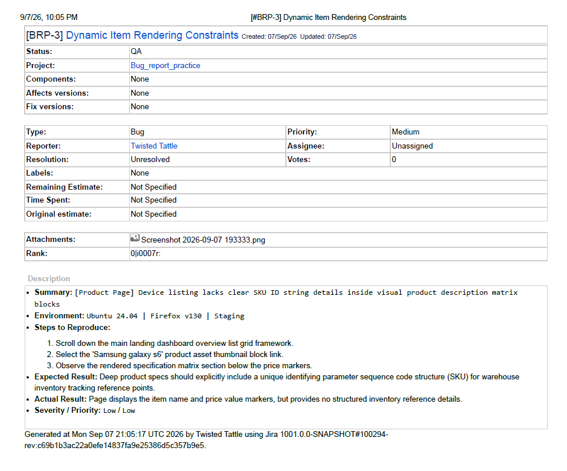
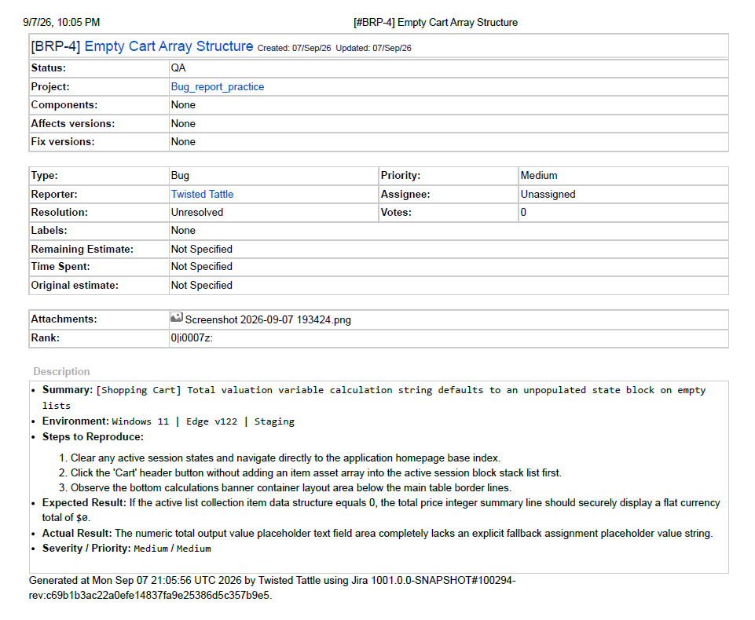

# Portfolio: Manual QA Testing & Jira Defect Lifecycle Simulation

This repository showcases real-world manual testing methodologies, boundary constraint evaluations, and structural bug logging practices using **Demo Blaze** as the target web application and **Jira Cloud** for issue tracking.

## 🛠️ Environment Configuration & Architecture
*   **Target Application Under Test (AUT):** [Demo Blaze Website](https://demoblaze.com)
*   **Defect Management Infrastructure:** Jira Software (Agile Kanban Board/Jira Software Bug Tracking)
*   **Testing Stratagems:** Explatory Testing, Form Validation Verification, Boundary Value Testing

---

## 📊 Agile Scrum/Kanban Pipeline Status
Below is a snapshot highlighting the current sprint tracking iteration context inside Jira, emphasizing item prioritization matrices and state categorizations.

---

## 🐛 Documented Bug Reports (Jira Extracts)

### 1. Missing Sign-Up Field Constraints
*   **Tracking ID:** BRP-01
*   **Severity:** Medium | **Priority:** Low
*   **Summary:** Submission of empty forms relies on basic unstyled browser notifications rather than clear inline context warnings.
*   **Visual Logs:**
    
    

### 2. Contact Message Omission Error
*   **Tracking ID:** BRP-02
*   **Severity:** High | **Priority:** Medium
*   **Summary:** Message request form configuration processes blank text parameter packets as successful completions.
*   **Visual Logs:**
    
    
### 3. Product Catalog Specification Gap
*   **Tracking ID:** BRP-03
*   **Severity:** Low | **Priority:** Low
*   **Summary:** Device index information layout omits essential system SKU/Inventory serialization code identification blocks.
*   **Visual Logs:**
    
    

### 4. Empty Cart Summary State Nullification
*   **Tracking ID:** BRP-04
*   **Severity:** Medium | **Priority:** Medium
*   **Summary:** Total price calculation variables default to an empty string on unpopulated product tables.
*   **Visual Logs:**
    
    
